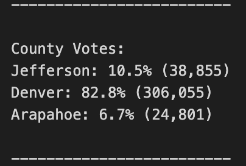
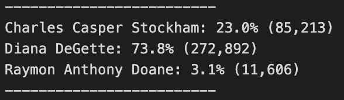
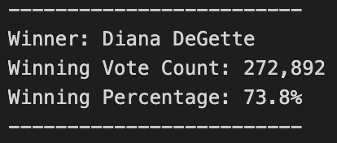

# Election Analysis

## Overview of Election-Audit

### Purpose
The purpose of this analysis is to assist Tom, a Board of Elections employee, with an election-audit of the tabulated results for a US congressional voting district in Colorado. His manager, Seth, is asking to automate the process using Python and report the results to a text file. After all votes are counted, we need to generate a vote count report to certify this US congressional race.

## Election-Audit Results

### Source and Files
* The election-audit analysis is based on the following data source: [election_results](Resources/election_results.csv).
* The completed election-audit analysis is available here: [PyPoll_Challenge](PyPoll_Challenge.py).
* The election-audit analysis script saved to a text file is available here: [election_results](Analysis/election_results.txt).

### Software
The software used to write, edit, save and execute scripts for this analysis are:
* Python 3.9.7
* Visual Studio Code 1.62.3

### Outcomes
* How many votes were cast in this congressional election?

The total votes in this congressional election was/were 369,711.  

* Provide a breakdown of the number of votes and the percentage of total votes for each county in the precinct.

The county votes are as follows:



To generate this county list with its respective number of votes and the percentage of total votes we first had to create a county list and county votes dictionary in the Python script:
```
county_list = []
county_dictionary = {}
```

A **for loop** was also used to get the county from the county dictionary.
```    
    for county_name in county_dictionary:

        countyvotes = county_dictionary.get(county_name)

        countyvote_percentage = float(countyvotes) / float(total_votes) * 100

        county_results = (
            f"{county_name}: {countyvote_percentage:.1f}% ({countyvotes:,})\n")
        
        print(county_results, end="") 
```

* Which county had the largest number of votes?

For this election, the largest county turnout was Denver with a total count of 306,055 votes.

* Provide a breakdown of the number of votes and the percentage of the total votes each candidate received.

The candidate votes are as follows:



Similar to our county list, we had to add a candidate list and a candidate dictionary to the Python script. Once that is initialized, we include a **conditional statement** also called **decision-making statement** with a **membership operator** to be able to record all candidates in a list with their respective votes. The code is as follows:

```
        if candidate_name not in candidate_options:

            candidate_options.append(candidate_name)

            candidate_votes[candidate_name] = 0

        candidate_votes[candidate_name] += 1
```

* Which candidate won the election, what was their vote count, and what was their percentage of the total votes?

Candidate Diana DeGette won the election with a total count of 272,892 votes and a winning percentage of 73.8% for this/the US congressional voting district in Colorado as displayed below:  



## Election-Audit Summary
Election-Audit Summary: In a summary statement, provide a business proposal to the election commission on how this script can be used—with some modifications—for any election. Give at least two examples of how this script can be modified to be used for other elections.
